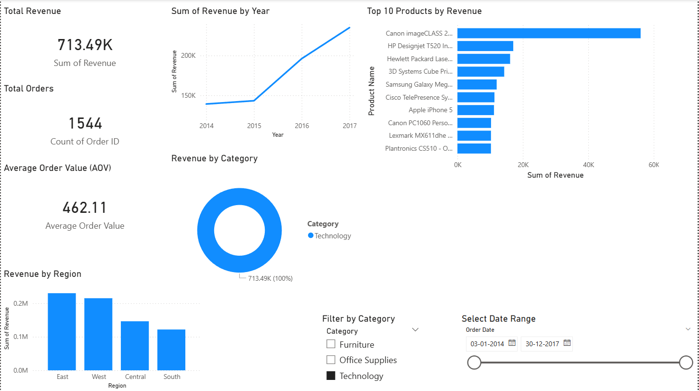

# Retail Sales Dashboard Project 
📊 Retail Sales Dashboard — End-to-End Data Analytics Project

This project is an end-to-end Data Analytics solution for a retail business using
Python, Power BI, SQL.
It analyzes customer orders, product performance, regional sales, and discount impact,
and presents insights through an interactive Power BI dashboard.

## 🚀 Project Objectives

    Clean and prepare Superstore retail data
    Perform Exploratory Data Analysis (EDA) in Python
    Build interactive dashboards for business insights
    Create SQL queries for key analytical questions
    Present insights through summary reports

## 🛠️ Tech Stack
Python (Pandas, Matplotlib)	     Cleaning + EDA
Power BI                         Dashboard + visualization
SQL (MySQL)	                     Analysis queries
Git & GitHub                     Version control
VS Code	                         Development

sales-dashboard-retail/
│
├── dashboard/
│     └── Retail_Sales_Dashboard.pbix
│
├── data/
│   ├── raw/
│   └── cleaned/
│         └── superstore_cleaned.csv
│
├── notebooks/
│   ├── 01_data_check.ipynb
│   └── 02_exploratory_visuals.ipynb
│
├── reports/
│   ├── Dashboard_Report.pdf
│   └── executive_summary.md
│
├── sql/
│   └── queries.sql
│
└── README.md

## 📊 Power BI Dashboard Highlights

The dashboard includes:

✔ KPIs

Total Revenue
Total Orders
Average Order Value

✔ Visuals

Revenue Over Time
Top 10 Products
Sales by Category
Sales by Region
Interactive slicers (Date, Category)
PDF export available in reports/Dashboard_Report.pdf.

## 📸 Dashboard Preview

## 📈 Insights Summary

Technology category leads revenue
Certain products disproportionately drive sales
Western region is strongest performer
Discounts increase sales but reduce net revenue
Revenue trends show seasonal fluctuations
Detailed summary available in reports/executive_summary.md

## 🧮 SQL Highlights

sql/queries.sql includes:

Total revenue
Monthly revenue
Top products
Revenue by region
Customer repeat orders
Discount impact analysis

## 🚀 Future Enhancements

Add forecasting models
New dashboards for supply chain
Build web-based version using Streamlit
Market basket analysis (product associations)
